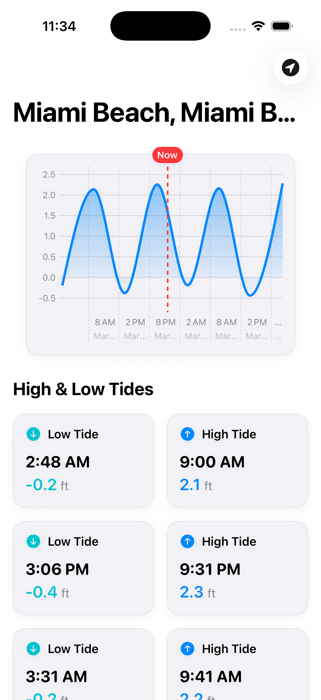
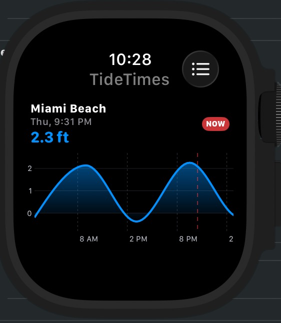

# TideTimes

TideTimes is a beautifully designed, intuitive iOS and Apple Watch application that provides accurate tide predictions for coastal locations. Built entirely with SwiftUI, the app allows users to search for coastal locations, visualize tide patterns through an interactive graph, and get the information they need whether they are using their iPhone or Apple Watch.

## Features

- **Comprehensive Tide Data**: Get accurate high and low tide times for domestic coastlines (via NOAA Tides and Currents API) and international locations (via WorldTides.info fallback API).
- **Interactive Tide Chart**: Visualize tide levels across 48 hours using a smooth, interactive bezier curve graph complete with a current time indicator.
- **Apple Watch App**: Fully featured companion app that lets you check tide times right from your wrist. Includes independent location search functionality.
- **Location Search**: Quickly find the nearest tide station by searching for a city or coastal location. The app uses MapKit and haversine distance calculations to seamlessly resolve your search to the closest station.
- **Modern Architecture**: Built with a robust MVVM pattern leveraging Swift's latest `@Observable` macros and native SwiftUI tools. No large external dependencies required!

## Screenshots

<div align="center">
  <figure style="display: inline-block; margin-right: 20px;">
    
    <figcaption>iPhone App</figcaption>
  </figure>
  <figure style="display: inline-block;">
    
    <figcaption>Apple Watch App</figcaption>
  </figure>
</div>

## Building the Project

The TideTimes project uses standard Apple development tools. You will need a Mac to build and run this application.

### Prerequisites

- macOS (latest recommended)
- [Xcode](https://developer.apple.com/xcode/)
- [Homebrew](https://brew.sh/) (optional, but recommended for managing development utilities)

### Getting Started

1. **Clone the repository:**
   ```bash
   git clone https://github.com/douglasmaltby/TideTimes.git
   cd TideTimes
   ```

2. **Install tools using Homebrew (Optional):**
   If you use Homebrew, you can ensure your Xcode command line tools and other helpful development utilities (like `swiftlint`) are up to date:
   ```bash
   brew update
   # Example: Install swiftlint to ensure code style consistency
   brew install swiftlint
   ```

3. **Open the project in Xcode:**
   ```bash
   open TideTimes.xcodeproj
   # Alternatively, just double-click the TideTimes.xcodeproj file in Finder.
   ```

4. **Build and Run:**
   - Select your target device (e.g., iPhone 17 Pro simulator or your connected iPhone/Apple Watch).
   - Press **Cmd + R** (`⌘R`) to build and run the application.
   - To build the Apple Watch target, make sure you select the `TideTimesWatch Watch App` scheme.

## Architecture & Code

TideTimes follows the **Model-View-ViewModel (MVVM)** pattern:
- **Models**: Defines data structures for Tide predictions (`TideData`) and API errors.
- **ViewModels**: Powered by Swift 5.10+ `@Observable` macro to naturally bind data with views. 
- **Views**: 100% SwiftUI, utilizing responsive `GeometryReader` canvases for the bezier charts.
- **Services**: `TideAPIClient` abstracts network requests to NOAA and other APIs.

## License

This project is licensed under the [GNU General Public License v3.0](LICENSE.md).
